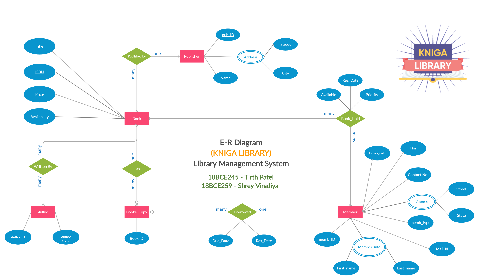
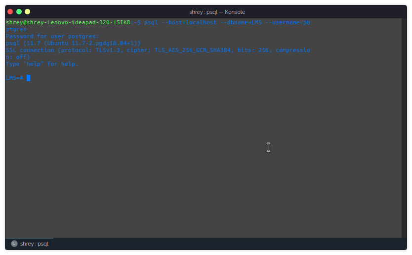
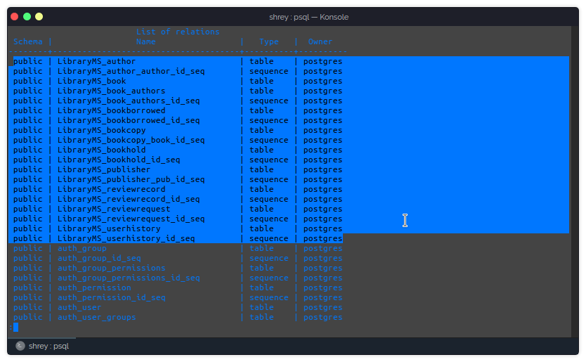
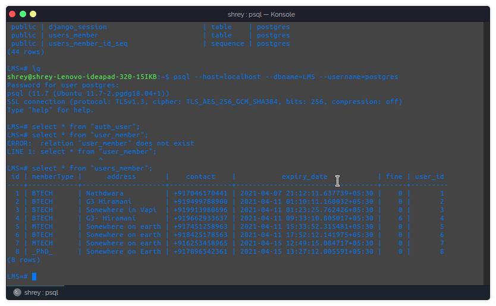
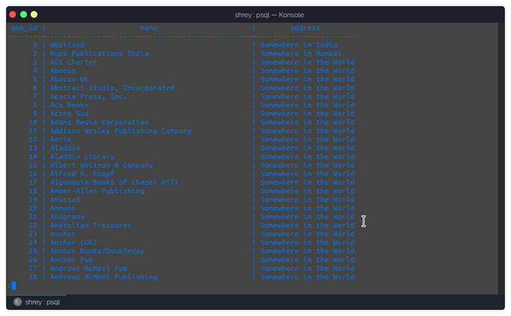
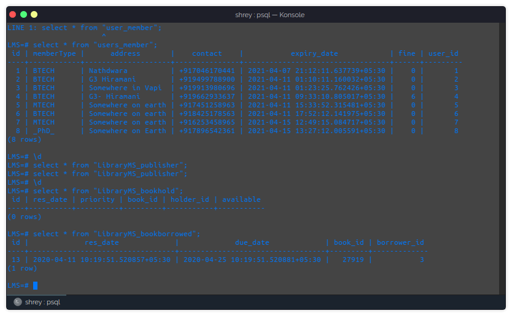

# LMS
Library Management System Project for DBMS and PSC

## Description
This project is Library Management System. Quite similar to the LMS we have in Nirma University. Project is implemented in django.
Django is python based framework for web application development. Instagram, Pintrest are few examples of famous web application written in django.

- For the database, we have used PostgreSQL.

### Demostration
Working demonstration of the project is in the video 
https://github.com/Shrey-Viradiya/LMS/blob/master/DBMS.mp4

### ER diagram

### Relational Model
.jpg)

### Screen Shots of psql

